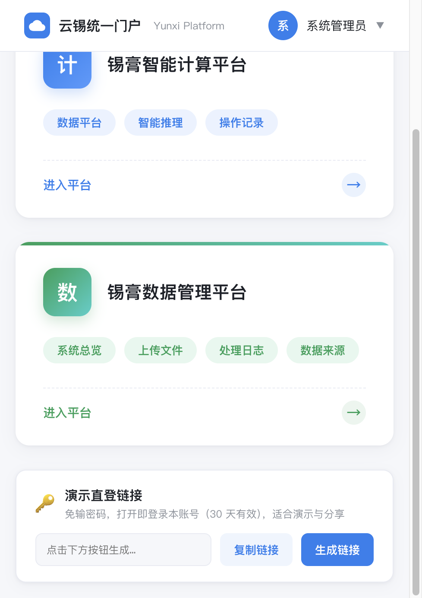
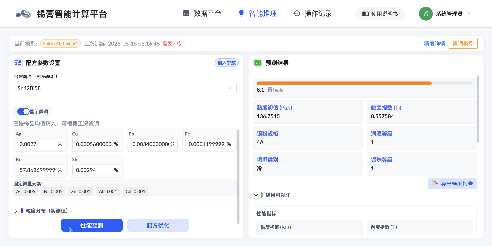
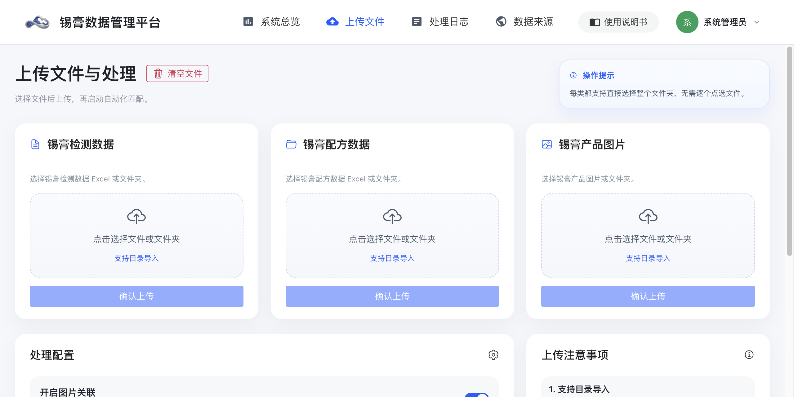
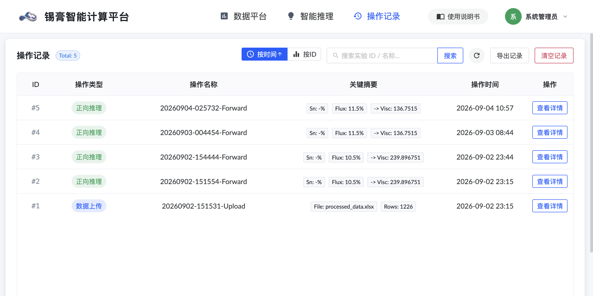
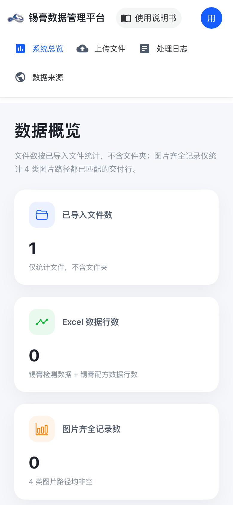
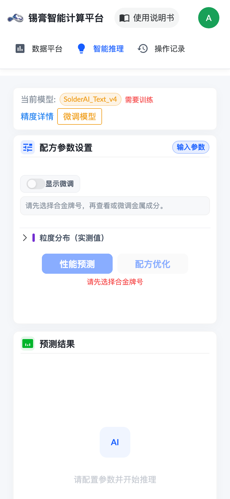
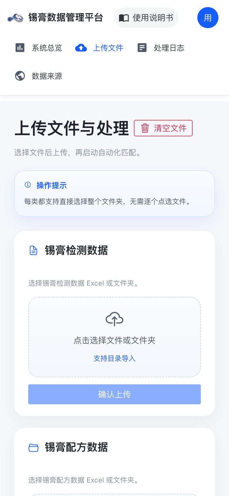
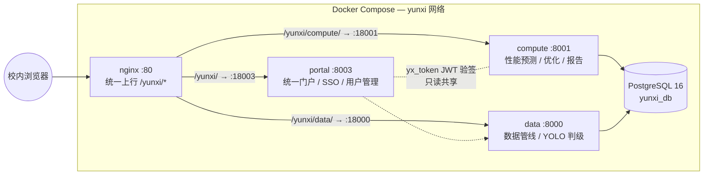

<div align="center">

# 🧪 Yunxi Solder Flux AI Platform

**云锡助焊剂 AI 平台** · 锡膏智能计算 × 数据管理 × 视觉判级 一体化校内演示平台

[](https://www.python.org/)
[](https://vuejs.org/)
[](https://fastapi.tiangolo.com/)
[](https://docs.ultralytics.com/)
[](https://docs.docker.com/compose/)
[](LICENSE)

[平台总览](#-平台总览) · [架构](#-系统架构) · [快速开始](#-快速开始) · [模型指标](#-模型性能) · [目录结构](#-目录结构)



</div>

---

## ✨ 平台总览

本平台面向**锡基助焊剂 / 锡膏配方研发**场景，由统一门户（SSO 单点登录）串联三大能力：

| 平台 | 能力 | 亮点 |
|---|---|---|
| 🔑 **统一门户** | 登录 / 用户管理 / 角色权限（Admin·Researcher·Viewer） | **演示令牌直登**：30 天免登录链接，发同事打开即用 |
| 🧮 **智能计算平台** | 配方性能预测 / 配方优化 / 预测报告（PDF）导出 | 机器学习模型一键预测 6 项锡膏关键性能，支持成分微调 |
| 📊 **数据管理平台** | Excel 批测数据导入 / 数据管线 / 处理日志 | 三层去重幂等导入；文件级断点续跑 |
| 👁 **视觉判级**（数据平台内置） | YOLOv8 润湿 / 焊球 / 塌陷三模型图像判级 | Top-3 置信度 + 标注图可视化 |

### 智能推理 · 一键预测配方性能

选择合金牌号后自动填充样品基准成分，点击「性能预测」即时得到 6 项性能输出与置信度：



### 数据管线 · Excel 批测数据入库

拖拽上传 → 自动解析校验 → 后台管线幂等导入，全程处理日志留痕：



### 操作记录 · 预测历史可追溯



### 📱 移动端适配

全站响应式布局，手机浏览器 / 企业微信内打开同样完整可用——顶部导航自动折行收纳、统计卡片重排、表格容器内滑动：

| 门户（iPhone 视口） | 数据平台仪表盘（iPhone 视口） |
| :---: | :---: |
|  |  |

| 推理平台（iPhone 视口） | 数据管线（iPhone 视口） |
| :---: | :---: |
|  |  |

## 🏗 系统架构

单镜像多角色（`SVC` 环境变量切换 portal / compute / data 三个服务），Compose 一键编排，nginx 子路径统一上行：



**设计要点**

- **SSO 单点登录**：门户登录后种 `yx_token` JWT，双平台各自验签（共享只读数据库行 + 同源 SECRET_KEY），全站免二次登录
- **子路径部署**：前端构建期固定 `base: /yunxi/<平台>/`，nginx `proxy_pass` 尾斜杠剥前缀，**单域名单端口承载三应用**，与既有业务零冲突
- **断电自愈**：全部容器 `restart: always`，服务器来电后自动满血恢复
- **演示令牌直登**：`POST /api/v1/auth/demo-token` 铸 30 天 JWT → `GET /t/{token}` 验签种 Cookie 302 回门户，适合把演示链接直接发给访客

## 🚀 快速开始

### 方式一：Docker Compose（推荐）

```bash
git clone https://github.com/thiswind/solder-flux-ai-platform.git
cd solder-flux-ai-platform

# 准备模型权重（不入库，需自行放置，见下方「模型权重」）
#   platforms/compute/weights/best.pt        性能预测模型
#   platforms/data/backend/models/yolo/{collapse,solderball,wetting}_all_cls/weights/best.pt

# 环境变量
cat > deploy/.env <<'EOF'
PORTAL_SECRET_KEY=change-me-to-a-random-string
YUNXI_PG_PASSWORD=change-me-too
EOF

docker compose -f deploy/compose.yml --env-file deploy/.env up -d --build
```

服务起好后：

| 服务 | 直连地址 |
|---|---|
| 统一门户 | http://localhost:18003 |
| 智能计算平台 | http://localhost:18001 |
| 数据管理平台 | http://localhost:18000 |

> 默认管理员 `admin / admin123`（首次启动自动创建，**生产环境务必修改**）。
> 需要像生产环境那样从 `http://<host>/yunxi/` 单入口访问，把 `deploy/nginx/yunxi-locations.conf` include 进你的 server 块即可（文件头部有注释说明）。

### 方式二：本地裸跑（开发调试）

```bash
# 1) 数据库（或直接改用 SQLite：修改各平台 .env 的 DATABASE_URL）
docker run -d --name yunxi-pg -e POSTGRES_PASSWORD=postgres \
  -e POSTGRES_DB=yunxi_db -p 5432:5432 postgres:16-alpine

# 2) 门户（先 conda activate base / python3.10）
cd portal && pip install -r requirements.txt 2>/dev/null || pip install fastapi uvicorn pyjwt bcrypt
python -m uvicorn backend.main:app --port 8003

# 3) 智能计算平台
cd platforms/compute
cp .env.example .env   # 改 DATABASE_URL
pip install -r requirements.txt
python -m uvicorn backend.main:app --port 8001

# 4) 数据管理平台
cd ../data/backend
cp .env.example .env   # 改 DATABASE_URL
pip install -r requirements.txt
python -m uvicorn app.main:app --port 8000
```

前端开发模式（热更新，根路径）：

```bash
cd platforms/compute/frontend && npm install && npm run dev   # :5173
cd platforms/data/frontend && npm install && npm run dev
```

> 前端生产构建产物默认按 `/yunxi/<平台>/` 子路径（`vite.config` 的 `base`）。若本地开发想用根路径直跑，把 `base` 改回 `/` 即可；`deploy/scripts/patch_frontend.py` 提供了幂等化的子路径补丁（含 API 前缀、门户跳转白名单共 14 处改造）。

## 🎯 模型性能

**性能预测模型**（SolderAI_Text_v4，训练样本 1210 行，28 维特征）

| 目标 | 任务 | 指标 |
|---|---|---|
| 黏度初值 | 回归 | **R² 0.922** · MAE 4.01 |
| 触变指数 Ti | 回归 | **R² 0.944** · MAE 0.008 |
| 锡粉规格 | 分类 | **Accuracy 98.3%** |
| 坍塌类别 | 分类 | **Accuracy 92.6%** |
| 锡珠等级 | 分类 | **Accuracy 97.5%** |
| 润湿等级 | 分类 | Accuracy 74.8% |

**YOLO 视觉判级**（数据平台内置）：润湿 / 焊球 / 塌陷三模型，判级输出 Top-3 置信度 + 标注可视化图。

> ⚠️ **模型权重与训练数据不随本仓库分发**（体积与数据合规原因），`weights/` 目录结构已就位，请向课题组获取后放入对应路径。

## 📁 目录结构

```
solder-flux-ai-platform/
├── portal/                    # 统一门户（登录/SSO/用户管理/演示令牌）
│   ├── backend/               #   FastAPI + SQLite（JWT/bcrypt）
│   └── static/                #   原生 JS 单页
├── platforms/
│   ├── compute/               # 锡膏智能计算平台
│   │   ├── backend/           #   FastAPI + PostgreSQL（推理/优化/报告）
│   │   ├── frontend/          #   Vue3 + Vite + Naive UI
│   │   └── weights/           #   ⚠️ 性能预测模型（不入库）
│   └── data/                  # 锡膏数据管理平台
│       ├── backend/           #   FastAPI + PostgreSQL + YOLO 判级
│       ├── frontend/          #   Vue3 + TS + Vite
│       └── models/yolo/       #   ⚠️ 三判级模型（不入库）
├── shared/                    # 跨服务 SSO 令牌验签组件
├── deploy/
│   ├── compose.yml            # 四容器编排（portal/compute/data/postgres）
│   ├── docker/                # Dockerfile（三平台统一镜像）+ entrypoint
│   ├── nginx/                 # 子路径反代片段
│   └── scripts/               # 前端子路径补丁 / 镜像构建脚本
├── docs/screenshots/          # README 配图
└── 模版/                       # Excel 上传模板
```

## 🔐 安全说明

- 所有密钥走环境变量（`deploy/.env`），仓库内仅含 `.env.example` 占位模板
- 密码 bcrypt 哈希存储；会话为 JWT（HttpOnly Cookie）
- `admin/admin123` 仅为首次启动演示默认值，部署后请立即修改

## 📄 License

[MIT](LICENSE)

---

<div align="center">
<sub>云南大学 信息学院 · 云锡助焊剂 AI 平台 · 校内演示项目 · 2026</sub>
</div>
